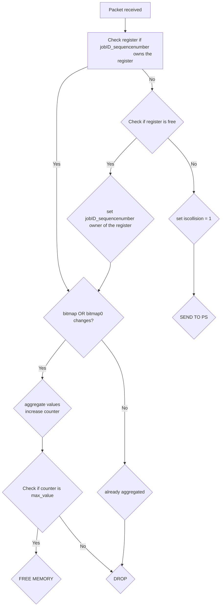

# ATP implementation in BMv2

## Requirements
In order to use the repository p4-utils must be installed with all its dependencies. To install it you can run the following command. More on: https://github.com/nsg-ethz/p4-utils
```
curl -sSL https://raw.githubusercontent.com/nsg-ethz/p4-utils/master/install-tools/install-p4-dev.sh | bash
```

## Implemented logic of the switch 


## Running the code
Initializing the network: 
```
sudo python3 network.py
```
Running the controller: 
```
sudo python3 controller.py
```
## Sending one packet from one worker
First tun in the mininet terminal 
```
xterm h1
```
Then you can send the packet with the following command. At the moment the packet will be a vector of ones (1, 1, ...). The switch does not implement yet any control when the packet arrives, it just sum on the register. 
```
sudo python3 worker.py -id <id> -sn <sn> -agg <agg>
```
## Visualizing aggregation results through the controller 

Then you can inizialize the script that receive the packet from the switch
```
sudo python3 controller.py -t <x>
```
The controller will print every x seconds all the values inside the register in the following way: 
```
Iterazione: 0 
0 0 0 0 0 0 0 0 0 0 0 0 0 0 0 0 0 0 0 0 
0 0 0 0 0 0 0 0 0 0 0 0 0 0 0 0 0 0 0 0 
0 0 0 0 0 0 0 0 0 0 0 0 0 0 0 0 0 0 0 0 
0 0 0 0 0 0 0 0 0 0 0 0 0 0 0 0 0 0 0 0 
0 0 0 0 0 0 0 0 0 0 0 0 0 0 0 0 0 0 0 0 
0 0 0 0 0 0 0 0 0 0 0 0 0 0 0 0 0 0 0 0 
0 0 0 0 0 0 0 0 0 0 0 0 0 0 0 0 0 0 0 0 
0 0 0 0 0 0 0 0 0 0 0 0 0 0 0 0 0 0 0 0 
0 0 0 0 0 0 0 0 0 0 0 0 0 0 0 0 0 0 0 0 
0 0 0 0 0 0 0 0 0 0 0 0 0 0 0 0 0 0 0 0 
Waiting ...
```
## Visualizing the topology
The script will also allow you to visualize the topology. In the folder /pictures there will be a simple sketch of the topology. 
